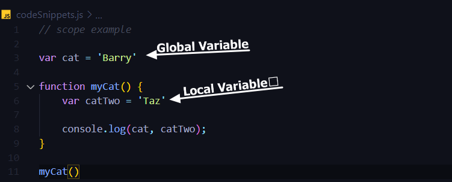
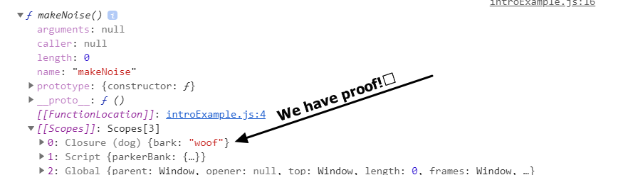

**Scope of students&#39; knowledge:**

- Basic understanding of data types in JavaScript (string, number, etc.)
- Basic understanding of functions in JavaScript.
- Basic understanding of arrays and objects in JavaScript.
- The student is aware of built in methods such as: .push, .pop .length. They are still getting used to these but they have the gist.
- The student is now learning more about the power of functions and the way a lexical environment works.
- Overall this would be the first time the student is exposed to the idea of closures in JavaScript.
- I chose to use the <code>var</code> keyword over <code>let</code> and <code>const</code>. Given the student is relatively new, this eliminates the behavior <code>let</code> has when used inside a block statement.

**Introduction (stoking interest):**

Before we get into this awesome topic that is closures in JavaScript, let us take some time to dissect important definitions and a quick review of how scope works. Here we go!

**Closure -** A  **closure**  is the combination of a function bundled together (enclosed) with references to its surrounding state (the  **lexical environment** ).

**Lexical Environment -** A **Lexical Environment** is a specification type used to define the association of Identifiers to specific variables and functions based upon the lexical nesting structure of ECMAScript code.

Okay, that was a lot of dense information to consume but I promise I will try to break this down and make it much more palpable. Closures are not unique to JavaScript but not every language uses them. The reason JavaScript uses closures has to do with the fact that it is a lexical environment. Before you freak out and say &quot;I have no idea what that means!&quot; If you have used a function in JavaScript, there is a good chance you have taken advantage of the lexical environment.

In other words, each function has access to **local** and **global** variables. Let me show you in code and it will click with you.

As you can see, <code>function myCat</code> is able to access both <code>cat</code> and <code>catTwo</code>. This is a simple and basic overview of what a lexical environment does. With this cleared out of the way, it&#39;s time to start on the meat and potatoes, closures!

Now that you have an idea of what a lexical environment looks like, the definition of closures should start to make a little more sense. I will get to more examples but let me break down the definition more. A function inside a function sounds a little scary and complicated. I&#39;m not going to lie, it&#39;s a little complicated but far from scary.

What is the purpose of writing a function inside of a function? Say that you needed to conceal some information that you don&#39;t want to be available anywhere else nor mutated outside of its functions scope. This is where a closure would come into play.

We can actually see this with the example above. If you were to place a console.log statement below the function body containing the variable <code>catTwo</code>, you would notice that it comes back undefined in the console. This means we can only effectively change that variable within its own function. In order to make this happen we need to create what we call a closure. Let&#39;s look at a few examples to really understand what is happening.

**Demos with explanation:**

<pre><code>function dog() {
    var bark = 'woof'

    function makeNoise() {
        console.log(bark)
    }

    return makeNoise
}

dog()()

var pug = dog()
pug()

console.dir(pug)</code></pre>

Let us start with a straightforward and simple example which gives us visual proof that it is a closure. First, we need to create a function named <code>dog</code> and within the function we define a variable named <code>bark</code> which equals &#39;woof&#39;. Now it&#39;s time to create magic! Inside of the dog function and below the newly defined variable, we are going to create a new function named <code>makeNoise</code>. Inside of this new function, we will place a console.log containing the variable <code>bark.</code> Back inside of function <code>dog</code> we want to return our new function <code>makeNoise</code>. We are not quite done yet but we are getting close.

The next question is: how do we get the inner function to execute? There are a few ways of doing this but in this example, I will be showing you two.

We can call function <code>dog</code> at the bottom but when you look inside of your console you will notice nothing has appeared. If we add another call onto function <code>dog</code>, it finally appears in the console correctly. We can call it in a different way which opens up more possibilities.

Below function <code>dog</code>, we are going to create a new variable called <code>pug</code> and assign function <code>dog</code> to it. Now we have created a new instance of function <code>dog</code>. If we call function <code>pug,</code> you will see that our function inside of a function is being called.

I told you that I would give you visual proof that this is a closure and don&#39;t think I forgot about that. At the bottom we are going to add a console.dir statement containing function <code>pug</code>. I am not going to explain everything inside of the console but if you click on the object inside your console you will see something called scope. Click on it! You should see a drop-down and inside of it you&#39;ll see something called closure and you will see the variable <code>bark</code>.

<pre><code>function familyCreator() {
    var dad = 'Mike'
    var mom = 'Virginia'
    var child = 'Pat'
    var savings = 0

    function familyPhoto(){
        console.log(dad + ' ' + mom + ' ' + child)
    }

    function addToSavings(){
        savings++
        console.log(savings);
    }

    return {familyPhoto, addToSavings}
}

var faucher = familyCreator()
faucher.addToSavings()
faucher.addToSavings()
faucher.addToSavings()
console.dir(faucher)
</code></pre>

Alright, the first example was easy and straightforward but let&#39;s dive in a little deeper and understand what&#39;s going on in the background.

In this example, I am going to create a function named <code>familyCreator,</code> inside of this function I am going to create four variables <code>dad</code>, <code>mom</code>, <code>child</code>, and <code>savings</code>. <code>dad</code>, <code>mom</code>, and <code>child</code> will all be assigned a string value and <code>savings</code> will be assigned zero.

Now it&#39;s time to create our first function inside of this function! Let&#39;s have our hypothetical family take a lovely family photo. Inside of function <code>familyCreator</code>, we are going to define another function named <code>familyPhoto</code> We want this function to console.log our entire family.

I know this is awfully similar to the first example but I&#39;m going to use this as a chance to explain closures a little deeper.

When a function is executed the variables inside of it are created. In some languages, once the function is over it throws away the variables it had. In JavaScript, we have closures! We can create an inner function which holds a reference to its outer functions variables. When the outer function is done executing, the inner function still holds on to its reference.

Let us add a new function inside of our <code>familyCreator</code> called <code>addToSavings</code>. We want this new function to add one to our <code>savings</code> every time it is called. Below, we will add a console.log statement which tells us if our <code>savings</code> is ticking upwards.

Now we have a new problem, we need to somehow return both of these functions. In JavaScript, we have the ability to return multiple functions if we encase them with curly brackets. I will show you below how to properly execute them.

Outside of our <code>familyCreator</code>, we will define a new variable named <code>smith</code> and I&#39;m going to point it towards our <code>familyCreator</code> function. Below that, we will call our new variable <code>smith</code> and access the inner functions with a <code>.</code>.

If we call the <code>addToSavings</code> function multiple times, we should see our family&#39;s savings increase. The reason it does not revert back to 0 after every call is because our <code>addToSavings</code> is holding a reference to its parent function&#39;s variable.

<pre><code>
function myBank() {
    var balance = 5
    var accountPIN = '@243$&%51234657879'

    function showBalance(PIN) {
        if(accountPIN === PIN){
            console.log(balance);
        } else {
            console.log('Wrong PIN')
        }
    }

    function depositeToBalance(amount){
        balance += amount
        console.log(balance)
    }

    function withdrawFromBalance(amount) {
        balance -= amount
        console.log(balance)
    }

    return { showBalance, depositeToBalance, withdrawFromBalance }
}

const parkerBank = myBank()
parkerBank.depositeToBalance(10)
parkerBank.withdrawFromBalance(7)
parkerBank.showBalance('@243$&%51234657879')
console.dir(parkerBank)
</code></pre>

Time for our third and final example of closures and this one is going to get a little bit more complicated. I want to show you the power of having hidden variables within your functions.

We are going to define a new function named <code>myBank</code> and inside of it we are going to define two variables. The first variable will be named <code>balance</code> which will equal 0. The second variable will be named <code>accountPIN</code> and we are going to assign it string of numbers.

Next, we are going to define three functions inside of <code>myBank</code> named: <code>showBalance</code>, <code>depositeToBalance</code>, <code>withdrawFromBalance</code>. Let us tackle each one of these separately!

<code>depositeToBalance</code>: we want this new function to accept one argument and the argument is <code>amount</code>. This amount represents how much we want to add to our balance. We do that by adding the amount to the <code>balance</code> variable which is in the parent function. Now let&#39;s put a console.log statement inside of this function to know that it is working properly.

<code>withdrawFromBalance</code>: this function is similar to the one we just did. Instead of adding we are just going to subtract the <code>amount</code> from the <code>balance</code> and console.log it.

Now that we have those 2 functions working and we can successfully deposite and withdraw from our new bank but we have no way to know how much money we have without having to withdraw or deposite. We know how to do this because it&#39;s no different than what we have done in the previous examples. We will have function <code>showBalance</code> console.log our balance when it&#39;s triggered. Easy enough, right?

I&#39;m sure a few of you have noticed the failed logic behind this. The code runs and does exactly what I wanted it to do but it is not secure. You don&#39;t want just anybody to be able to access your bank account. One way we could fix this is by adding an argument to our <code>showBalance</code> function. We could call this argument anything but for clarity we will call it <code>PIN</code>.

Now we only want to show the balance when the argument passed to our <code>showBalance</code> matches our variable <code>accountPIN</code>. The easiest way to do this is with a simple if statement. If the numbers match we will console.log the <code>balance</code> and if they do not match we will console.log &#39;wrong PIN!&#39;

As you can see, having hidden variables and references to them, you can conceal important information. This may be a very simple example of that power but as you can imagine it can be useful. From server requests to keeping sensitive information out of reach and many more applications.

**Hands-on activities / problems:**

Problem #1 - I want you to define a function named <code>treasure</code> which has two variables inside of it. One of these variables needs to be assigned a string value which represents the loot inside the treasure. The second variable needs to be assigned a string value and this will represent the key to unlock the chest. Using a closure, you need to define a function inside of <code>treasure</code> which accepts an argument. This new function, will console.log the loot if argument matches the key variable and if they do not match it will console.log a denial message.

Hint: Refer to example #3.
<pre><code>
function treasure(){
    
}
var myTreasure = treasure()
</code></pre>

Problem #2 - I want you to define a function named <code>calorieCounter</code> and inside of the function define a variable with the number 0 assigned to it. Inside of <code>calorieCounter</code> I want you to define 3 functions: <code>addCalories</code>, <code>subtractCalories</code>, and <code>clear</code>. <code>addCalories</code> accepts one argument and it needs to add that argument to the variable stored in its parent function. Do the same with the <code>subtractCalories</code> function but instead of adding you need to subtract. For the <code>clear</code> function, I want you to set the value of its parent function variable back to 0.

Hint: refer to examples two and three. Use curly brackets when you need to return multiple inner functions.

<pre><code>
function calorieCounter(){
    
}
var calCalc = calorieCounter()
</code></pre>

Problem #3 (Extra difficult) - this problem will require you to dig into your programming toolbox but I&#39;m confident you will be able to figure it out. I want you to define a function named <code>family</code>, inside of this function I want you to define an empty array. Next, I want you to create a function inside of <code>family</code>, this function will accept an argument. I want you to push the argument into the array we defined in the parent function. Next, you will create another function inside of <code>family</code>, this function will loop through the array we have defined in the parent function and console.log each member. Once finished, I want you to create your family using your new function <code>family</code>!

Hint: Array method .push. for… of loops.
<pre><code>
function family(){
    
}
var Smith = family()
</code></pre>

**Review session and problems:**

Problem #1 (treasure): Okay, let us dive into this first problem! We need to first define a function named <code>treasure</code> and then we create two variables. I named mine <code>loot</code> and <code>key</code> because in my mind that is the name that best represents what they&#39;re going to do. I assigned the string value of &#39;We are rich!&#39; to the <code>loot</code> variable and I assigned &#39;2U&#39; to the <code>key</code> variable.

Simple part out of the way, it&#39;s time we do the magic, closure! We create an inner function named <code>openChest</code> which accepts one argument. I wanted this argument to represent a password of some sorts that would fetch some type of data if the credentials matched. You might not see closures being explicitly used like they are in these examples and activities but this should give you an idea of the role they play when you are developing.

Inside this new function, we will create an if statement to check if the <code>password</code> argument matches our key inside the parent function. If the password matches the key then we will console.log the <code>loot</code> If the password does not match the key we will console.log a custom denial message of your choice.

Since we do not have more than one inner function all we need to do is return <code>openChest</code>. We can check our closures by doing a console.dir on our function.

<pre><code>
function treasure() {
    var loot = 'We are rich!'
    var key = '2U'

    function openChest(password){
        if(password === key){
            console.log(loot)
        } else {
            console.log('Get outta here!')
        }
    }

    return openChest
}

var myTreasure = treasure()
myTreasure('2U')
</code></pre>

Problem #2 (calorieCounter): this next problem has a few moving pieces and requires us to take advantage of how closures keep a reference to the parents variable and does not reset after the function has been executed.

Inside of our main function named <code>calorieCounter</code> we are going to define a variable in which I named <code>totalCalories</code> but you can decide to name it anything you would like. This variable will hold the amount of calories we have consumed.

Now we need some way to change the value of <code>totalCalories</code> and we can do this with closures. I&#39;m going to define three functions inside of my <code>calorieCounter</code> named <code>addCalories</code>, <code>subtractCalories</code> and <code>clear</code>. Both <code>addCalories</code> and <code>subtractCalorie</code> accept an argument (<code>numberOfCalories</code>) which represents the amount of calories you want to add or subtract from your total. In the <code>addCalories</code> function we are going to add <code>totalCalories</code> to <code>numberOfCalories</code> using the <code>+=</code> operator. We will do the same with the <code>subtractCalories</code> function using the <code>-=</code> operator instead.

Now for the final function named <code>clear</code>, this function will not accept any arguments and should return the <code>totalCalories</code> variable back to zero. We do this by simply taking the <code>totalCalories</code> and equaling it to zero.

With all of our functions now completed, all we need to do is return them encased in curly brackets. Below we can now check if our work paid off.

This is a prime example of how closures use references to its parent function&#39;s variables.

<pre><code>
function calorieCounter(){
    var totalCalories = 0

    function addCalories(numberOfCalories){
        totalCalories += numberOfCalories
        console.log(totalCalories);
    }

    function subtractColories(numberOfCalories){
        totalCalories -= numberOfCalories
        console.log(totalCalories);
    }

    function clear() {
        totalCalories = 0
        console.log(totalCalories);
    }

    return { addCalories, subtractColories, clear }
}
</code></pre>

Problem #3 (family): I wanted to create a problem where you would have to use more tools in your toolbox in order to get the right answer while using the new knowledge you have of closures. Let us solve this together!

We need to create a function named <code>family</code> and inside of this function we need to create a variable which equals an empty array. I named this array <code>familyArray</code> but you are free to name it anything you would like. We are going to use this array to store string values which represent the names of the family members we are going to create.

Now that we have our <code>familyArray</code>, we need to create a function in order to add family members&#39; names. We will call this new inner function <code>addMember</code> and it will have one argument (<code>name</code>) which will represent the family member you want to add to the <code>familyArray</code>. Now we can take the <code>name</code> argument and push it with the array method .push() which takes the <code>name</code> and adds it to the <code>familyArray</code>. We can check this below by calling this function with the argument equal to the string value name you want to add.

Alright, we now can add people to our family which is a good thing! Next step, we want to be able to console.log each one of our family members that are in our <code>familyArray</code>. We can do this easily with a for… of loop or a regular for loop whichever you are comfortable with. All we have to do now is loop through our array and for each loop we want to console.log that element.

With that being completed we should be able to call it below and see each one of our family members in the console.

<pre><code>
function family(){
    var familyArray = []

    function addMember(name){
        familyArray.push(name)
        console.log(familyArray)
    }

    function callFamily(){
        for( var person of familyArray){
            console.log(person)
        }
    }

    

    return {callFamily, addMember}
}
var Favre = family()
Favre.addMember('Parker')
Favre.addMember('Virginie')
Favre.addMember('Peter')
Favre.callFamily() 
</code></pre>

**Review Conclusion:**

Closures are similar to a lot of things in the computer science realm, it&#39;s abstract. With these demonstrations and problems, I tried to break down the idea of closures to its simplest form. The deeper you get into the topic the more you will realize the vast depth of it and I only touched the tip of the iceberg. The cool thing about closures is it&#39;s not only unique to JavaScript, it can be applied to many other popular programming languages such as: Python, Java, and C#. It&#39;s worth diving deeper into the documentation on closures because it&#39;s knowledge you can use across the computer science field. The better we understand our code, the better our programs run.

I hope you enjoyed!

**References:**

- Lexical Environment - [http://es5.github.io/#x10.2](http://es5.github.io/#x10.2)
- Closures definition - [https://developer.mozilla.org/en-US/docs/Web/JavaScript/Closures](https://developer.mozilla.org/en-US/docs/Web/JavaScript/Closures)
